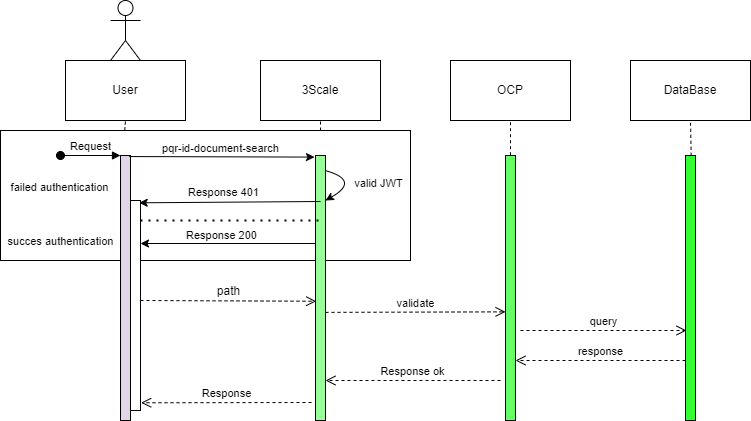

# Diseño Funcional Operación colegio

## Índice

- [Diseño Funcional Operación colegio](#diseño-funcional-operación-nombre)
  - [Índice](#índice)
  - [1. Descripción](#1-descripción)
  - [2. Diagrama de Secuencia](#2-diagrama-de-secuencia)
  - [3. Características](#3-características)
  - [4. Estructura del Mensaje](#4-estructura-del-mensaje)
    - [Definición de Campos](#definición-de-campos)
    - [Definición de Grupos](#definición-de-grupos)
  - [5. Ejemplos Mensajes](#5-ejemplos-mensajes)
  - [Diseño Técnico Operación colegio](#diseño-técnico-operación-nombre)
  - [Orquestación de Servicios](#orquestación-de-servicios)
  - [Integración de Servicios](#integración-de-servicios)
    - [1. Características Proveedor](#1-características-proveedor)
    - [2. Mapeo de Campos](#2-mapeo-de-campos)
    - [3. Especificación Mapeo de Valores](#3-especificación-mapeo-de-valores)
    - [4. Mapeo de Errores](#4-mapeo-de-errores)

---

## 1. Descripción

Servicio que trae de la BD llamada colegio y trae la  información de las tablas tb_salones,tbl_alumnos,tbl_materias .


[Volver al Índice](#índice)

---

## 2. Diagrama de Secuencia

A continuación, se relaciona el diagrama de secuencia objeto de este diseño.



[Volver al Índice](#índice)

---

## 3. Características

| Característica | Descripción |
| -------------- | ----------- |
| **Iniciador** | Consumidor interno/externo |
| **Método de transferencia** | REST |
| **Sintaxis** | JSON |
| **Método HTTP** | GET |
| **Path externo** | ***/[nivel 1 eTOM)]/[telefonica]/[version]/[nombre_microservicio]/[nombre_operación][parametros]***<br> /service/nttdata/service/v1/prueba-microcolegio1/colegio/
| **Path interno** | ***/[telefonica]/[version]/[nombre_microservicio]/[nombre_operación][parametros]***<br> /nttdata/v1/prueba-microcolegio1/colegio/

[Volver al Índice](#índice)

---

## 4. Estructura del Mensaje

### Definición de Campos

  <body>
<style>
@page { margin-left: 0.7in; margin-right: 0.7in; margin-top: 0.75in; margin-bottom: 0.75in; }
body { margin-left: 0.7in; margin-right: 0.7in; margin-top: 0.75in; margin-bottom: 0.75in; }
</style>
    <table border="0" cellpadding="0" cellspacing="0" id="sheet0" class="sheet0 gridlines">
        <col class="col0">
        <col class="col1">
        <col class="col2">
        <col class="col3">
        <col class="col4">
        <col class="col5">
        <col class="col6">
        <tbody>
          <tr class="row0">
            <td class="column0 style10 s style10" colspan="2">Access</td>
            <td class="column2 style8 s style9" rowspan="2">Field Name</td>
            <td class="column3 style8 s style9" rowspan="2">Child Fields</td>
            <td class="column4 style8 s style9" rowspan="2">Description</td>
            <td class="column5 style8 s style9" rowspan="2">Type</td>
            <td class="column6 style8 s style9" rowspan="2">Required?</td>
          </tr>
          <tr class="row1">
            <td class="column0 style1 s">(I/O)</td>
            <td class="column1 style1 s">Type</td>
          </tr>
          <tr class="row10">
            <td class="column0 style2 s">O</td>
            <td class="column1 style15 s">Body</td>
            <td class="column2 style3 s">idSalon</td>
            <td class="column3 style3 s">NA</td>
            <td class="column4 style5 s">Texto</td>
            <td class="column5 style4 s">NUMBER</td>
            <td class="column6 style6 s">Y</td>
          </tr>
          <tr class="row10">
            <td class="column0 style2 s">O</td>
            <td class="column1 style15 s">Body</td>
            <td class="column2 style3 s">nombreSalon</td>
            <td class="column3 style3 s">NA</td>
            <td class="column4 style5 s">Texto</td>
            <td class="column5 style4 s">STRING</td>
            <td class="column6 style6 s">Y</td>
          </tr>
          <tr class="row10">
            <td class="column0 style2 s">O</td>
            <td class="column1 style15 s">Body</td>
            <td class="column2 style3 s">cantidad</td>
            <td class="column3 style3 s">NA</td>
            <td class="column4 style5 s">Texto</td>
            <td class="column5 style4 s">NUMBER</td>
            <td class="column6 style6 s">Y</td>
          </tr>
          <tr class="row10">
            <td class="column0 style2 s">O</td>
            <td class="column1 style15 s">Body</td>
            <td class="column2 style3 s">idAlumnos</td>
            <td class="column3 style3 s">NA</td>
            <td class="column4 style5 s">Texto</td>
            <td class="column5 style4 s">NUMBER</td>
            <td class="column6 style6 s">Y</td>
          </tr>
          <tr class="row10">
            <td class="column0 style2 s">O</td>
            <td class="column1 style15 s">Body</td>
            <td class="column2 style3 s">documentoAlumno</td>
            <td class="column3 style3 s">NA</td>
            <td class="column4 style5 s">Texto</td>
            <td class="column5 style4 s">STRING</td>
            <td class="column6 style6 s">Y</td>
          </tr>
          <tr class="row10">
            <td class="column0 style2 s">O</td>
            <td class="column1 style15 s">Body</td>
            <td class="column2 style3 s">nombreAlumno</td>
            <td class="column3 style3 s">NA</td>
            <td class="column4 style5 s">Texto</td>
            <td class="column5 style4 s">STRING</td>
            <td class="column6 style6 s">Y</td>
          </tr>
          <tr class="row10">
            <td class="column0 style2 s">O</td>
            <td class="column1 style15 s">Body</td>
            <td class="column2 style3 s">attachmentName</td>
            <td class="column3 style3 s">NA</td>
            <td class="column4 style5 s">Texto</td>
            <td class="column5 style4 s">STRING</td>
            <td class="column6 style6 s">Y</td>
          </tr>
          <tr class="row10">
            <td class="column0 style2 s">O</td>
            <td class="column1 style15 s">Body</td>
            <td class="column2 style3 s">fechaNacimineto</td>
            <td class="column3 style3 s">NA</td>
            <td class="column4 style5 s">Texto</td>
            <td class="column5 style4 s">NUMBER</td>
            <td class="column6 style6 s">Y</td>
          </tr>
          <tr class="row10">
            <td class="column0 style2 s">O</td>
            <td class="column1 style15 s">Body</td>
            <td class="column2 style3 s">direccionVivienda</td>
            <td class="column3 style3 s">NA</td>
            <td class="column4 style5 s">Texto</td>
            <td class="column5 style4 s">STRING</td>
            <td class="column6 style6 s">Y</td>
          </tr>
           <tr class="row10">
            <td class="column0 style2 s">O</td>
            <td class="column1 style15 s">Body</td>
            <td class="column2 style3 s">nombreAcudiente</td>
            <td class="column3 style3 s">NA</td>
            <td class="column4 style5 s">Texto</td>
            <td class="column5 style4 s">STRING</td>
            <td class="column6 style6 s">Y</td>
          </tr>
           <tr class="row10">
            <td class="column0 style2 s">O</td>
            <td class="column1 style15 s">Body</td>
            <td class="column2 style3 s">numeroContacto</td>
            <td class="column3 style3 s">NA</td>
            <td class="column4 style5 s">Texto</td>
            <td class="column5 style4 s">STRING</td>
            <td class="column6 style6 s">Y</td>
          </tr>
           <tr class="row10">
            <td class="column0 style2 s">O</td>
            <td class="column1 style15 s">Body</td>
            <td class="column2 style3 s">idmateria</td>
            <td class="column3 style3 s">NA</td>
            <td class="column4 style5 s">Texto</td>
            <td class="column5 style4 s">NUMBER</td>
            <td class="column6 style6 s">Y</td>
          </tr>
           <tr class="row10">
            <td class="column0 style2 s">O</td>
            <td class="column1 style15 s">Body</td>
            <td class="column2 style3 s">nombreMateria</td>
            <td class="column3 style3 s">NA</td>
            <td class="column4 style5 s">Texto</td>
            <td class="column5 style4 s">STRING</td>
            <td class="column6 style6 s">Y</td>
          </tr>
           <tr class="row10">
            <td class="column0 style2 s">O</td>
            <td class="column1 style15 s">Body</td>
            <td class="column2 style3 s">notaFinal</td>
            <td class="column3 style3 s">NA</td>
            <td class="column4 style5 s">Texto</td>
            <td class="column5 style4 s">STRING</td>
            <td class="column6 style6 s">Y</td>
          </tr>
        </tbody>
    </table>
  </body>

[Volver al Índice](#índice)

---

## 5. Ejemplos Mensajes

Request \[URL/body]

```json
/nttdata/service/v1/prueba-microcolegio1/colegio/?=

```

Response body

```json
{
    
    "response": 
        {
            "idSalon": 1,
            "nombreSalon": "Once",
            "cantidad": 30,
            "alumnos": 
                {
                    "idAlumnos": 1,
                    "documentoAlumno": "Juan Peres Ortiz",
                    "nombreAlumno": "Juan Peres Ortiz",
                    "fechaNacimineto": "2002-04-10",
                    "direccionVivienda": "calle 6 # 6-50",
                    "nombreAcudiente": "Alvaro Peres",
                    "numeroContacto": "3503603640",
                    "idSalon": 1,
                    "materia": [
                        {
                            "idmateria": 1,
                            "nombreMateria": "ingles",
                            "notaFinal": "30",
                            "idAlumnos": 1
                        }
                    ]
                },
    },
    "serviceException": {
        "messageId": "200",
        "text": "La operación fue exitosa.",
        "variables": null
    }
}
```

[Volver al Índice](#índice)

---

## Diseño Técnico Operación colegio

## Orquestación de Servicios

Esta sección no aplica para esta interfaz.

[Volver al Índice](#índice)

---

## Integración de Servicios

### 1. Características Proveedor

| Característica | Descripción |
| -------------- | ----------- |
| **Sistema**    | [backend] |
| **Método de transferencia** |       REST      |
| **Sintaxis** |    JSON     |
| **Método HTTP** |   GET   |
| **Servicio** |      colegio       |

[Volver al Índice](#índice)

---

### 2. Mapeo de Campos

Input Mappings

| MPI | MPI | Operation | Type | Formula
| -------- | -------- | -------- |-------- | -------- |
|      | it is a pass through     | Text     |STRING     | Request Param     |

Output Mappings

| MPI | MPI | Operation | Type | Formula
| -------- | -------- | -------- |-------- | -------- |
| idSalon     | it is a pass through     | Text     |NUMBER     | Body Parameters     |
| nombreSalon     | it is a pass through     | Text     |STRING     | Body Parameters     |
| cantidad     | it is a pass through     | Text     |NUMBER     | Body Parameters     |
| idAlumnos     | it is a pass through     | Text     |NUMBER     | Body Parameters     |
| documentoAlumno     | it is a pass through     | Text     |STRING     | Body Parameters     |
| nombreAlumno     | it is a pass through     | Text     |STRING     | Body Parameters     |
| fechaNacimineto     | it is a pass through     | Text     |NUMBER     | Body Parameters     |
| direccionVivienda     | it is a pass through     | Text     |STRING     | Body Parameters     |
| nombreAcudiente     | it is a pass through     | Text     |STRING     | Body Parameters     |
| numeroContacto     | it is a pass through     | Text     |STRING     | Body Parameters     |
| idmateria     | it is a pass through     | Text     |NUMBER     | Body Parameters     |
| nombreMateria     | it is a pass through     | Text     |STRING     | Body Parameters     |
| notaFinal     | it is a pass through     | Text     |STRING     | Body Parameters     |


[Volver al Índice](#índice)

---

### 3. Especificación Mapeo de Valores

Esta sección no aplica para esta interfaz.

[Volver al Índice](#índice)

---

### 4. Mapeo de Errores

Cuando ocurre un error en el servicio se debe realizar el mapeo de acuerdo con la sección 2. Mapeo de Campos y el estándar del documento de errores.

[Volver al Índice](#índice)
